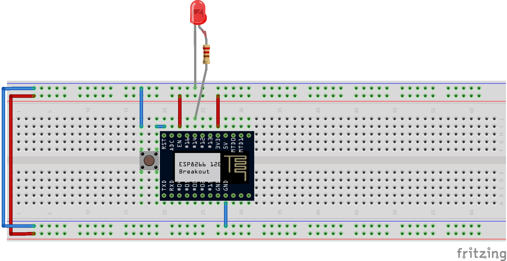

## 01_blink

This is a traditional *Hello World* sample for the *ESP8266* board and *Arduino* framework.

First lets connect the hardware...

#### Hardware



Connections of ESP8266 pins:
* `RST` of ESP8266 connected via a push connector to `LOW`.
  * Once the button gets reset it will restart our program (and the chip).
* `EN` is connected to `HIGH` to *enable* the chip.
  * The chip enters *sleep mode* if connected to `LOW` (or not connected at all).  
  * *Sleep mode* is used to lower the power consumption.
* `GND` and `3V3` is connected to `GND` and voltage `3.3V` respectively.      

The sample program will blink a LED. The LED's anode (shorter leg) is connected to `GND`, the cathode is connected via a 220&#937; resistor to the GPIO pin `#14`. The resistor is needed to limit the current on the LED (not to burn it).

#### Software

The structure of the project files comes from the [Platform IO](http://platformio.org/). The most interesting part of the sample is located under `src\Main.cpp`:

```cpp
#include <Arduino.h>

#define LED 12

void setup()
{
  // initialize LED digital pin as an output.
  pinMode(LED, OUTPUT);
}

void loop()
{
  // turn the LED on (HIGH is the voltage level)
  digitalWrite(LED, HIGH);
  // wait for a second
  delay(1000);
  // turn the LED off by making the voltage LOW
  digitalWrite(LED, LOW);
   // wait for a second
  delay(1000);
}
```

Any program should have exactly one `setup()` and `loop()` functions. The `setup` is executed once when the chip start (or resets). `loop` is executed repeatedly.

The `#include <Arduino.h>` is required to include the Arduino framework functions.
