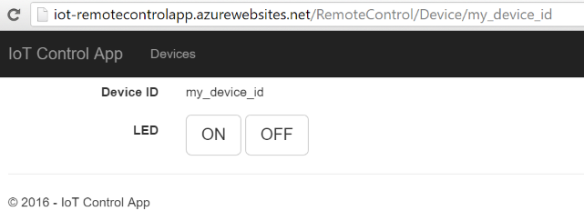

### 05. First Trivial Remote Control (`05_RemoteControl`)

The example consists of two apps:
* client: ESP device with a connected LED (C++)
* server: Web app that controls the LED remotely (C#, ASP.NET, Web)

This example shows how to communicate with a remote host over TCP/IP from the ESP device. Specifically the client device will connect with the remote web app over *HTTP* and pull the device state ([long polling](https://en.wikipedia.org/wiki/Push_technology#Long_polling)).
This minimal setup will allow us to drive a LED on the ESP device remotely (e.g. from outside of the building).

Here is the conceptual diagram:

ToDo: diagram needed

We need to agree on the communication scheme between the ESP device and our web app:
* *HTTP* protocol will be used as transport layer
* The device will pull the LED state (on/off state) every second from the server.
* The device will know the host of the web app
* The LED state will be represented as character `0` for off and `1` for on.

Lets start with the web app first...

#### Control web app (`05_RemoteControl_App`)

Folder `05_RemoteControl_App` contains an *ASP.NET* project.
The web app exposes two *RESTful* methods:

1. `http://{host}/api/device/{device_id}/state`
	* Responds with the {state} of the device `{my_device_id}`.
	* The response is `plain/text` encoded in `ASCII`.
	* The values returned will be - either `0` or `1`.
2. `http://{host}/api/device/{device_id}/?state={state}`
	* Allows us to set the `{state}` for `{my_device_id}`.  

The ESP device will use the #1st method to pull the state.
Notice that the web app does not know about the devices until they first connect.

The web app has been deployed to an Azure Website: http://iot-remotecontrolapp.azurewebsites.net. We can use it for testing:

1. Fetch the state of `my_device_id` device from the test server:
	* http://iot-remotecontrolapp.azurewebsites.net/api/device/my_device_id/state
	* Returns: `0`
2. We can now set the state to `1`:
  * http://iot-remotecontrolapp.azurewebsites.net/api/device/my_device_id/?state=1
3. Then a call to:
 	* http://iot-remotecontrolapp.azurewebsites.net/api/device/my_device_id/state
 	* Returns: `1`

The web app also has a simple [user interface](http://iot-remotecontrolapp.azurewebsites.net). From the top menu we can navigate *Devices > my_device_id* to open the device control page:



The web app is not that interesting, so let's move on to the client device (ESP).

#### Client device (`05_RemoteControl`)

The hardware setup should be the same as in [01_Blink](#01_blink) sample (ESP with LED).

The crux of the sample is the usage of `HTTPClient` class. It makes working with *HTTP* protocol easy. The class provides a higher abstraction over the low level *TCP/IP Socket* interface (`WiFiClient` class).

```cpp
bool tryGetDeviceState(String& payload)
{
  bool success = false;
  String url = String("http://") + server_host + "/api/device/" + device_id + "/state";
  Serial.print("[HTTP] Connecting to ");
  Serial.println(url);

  HTTPClient http;
  http.begin(url);

  int httpCode = http.GET();
  if (httpCode > 0)
  {
    // HTTP header has been send and Server response header has been handled
    Serial.printf("[HTTP] GET... code: %d\n", httpCode);

    // file found at server
    if (httpCode == HTTP_CODE_OK)
    {
      payload = http.getString();
      Serial.println("Response:");
      Serial.println(payload);
      success = true;
    }
  }
  else
  {
    Serial.printf("[HTTP] GET... failed, error: %s\n", http.errorToString(httpCode).c_str());
  }

  http.end();

  Serial.println("[HTTP] Closing connection");
  Serial.println();
  return success;
}
```

The program pulls the device state from the web app (every 2 seconds):

```cpp
void loop()
{
	if (WiFi.status() != WL_CONNECTED)
  {
    Serial.println("WiFi not connected.");
    delay(1000);
    return;
  }

  String payload;
  if (tryGetDeviceState(payload))
  {
    digitalWrite(STATUS_LED, payload == "1" ? HIGH : LOW);
  }
  delay(2000);
}
```

Any change done in the web app will eventually be reflected in the device's LED:
```
[HTTP] Connecting to http://iot-remotecontrolapp.azurewebsites.net/api/device/my_device_id/state
[HTTP] GET... code: 200
[HTTP] Response:
0
[HTTP] Closing connection

[HTTP] Connecting to http://iot-remotecontrolapp.azurewebsites.net/api/device/my_device_id/state
[HTTP] GET... code: 200
[HTTP] Response:
1
[HTTP] Closing connection
```

#### Reference

* [`HTTPClient` examples (ESP-Arduino)](https://github.com/esp8266/Arduino/blob/master/doc/esp8266wifi/client-examples.md)
* [`WiFiClient` reference](https://github.com/esp8266/Arduino/blob/master/doc/esp8266wifi/client-class.md)
* [`WiFiClient` examples (ESP-Arduino)](https://github.com/esp8266/Arduino/tree/master/libraries/ESP8266WiFi/examples/WiFiClient)
* [`WiFiClientSecure` reference](https://github.com/esp8266/Arduino/blob/master/doc/esp8266wifi/client-secure-class.md)

#### Worth reading (at home)
* [ESP8266WiFi](https://github.com/esp8266/Arduino/blob/master/doc/esp8266wifi/readme.md)

#### Improvements

This is the first useful example of an IoT system. Yet its trivial and has many limitations:
* The long polling communication does not scale when more devices are connected. We will look at alternatives later.
* The security is poor. Since the communication is exposed on the Internet anyone could easily drive our LED.
* While the LED state command representation on-the-wire is simple its not extensible when we add more elements to our device.
