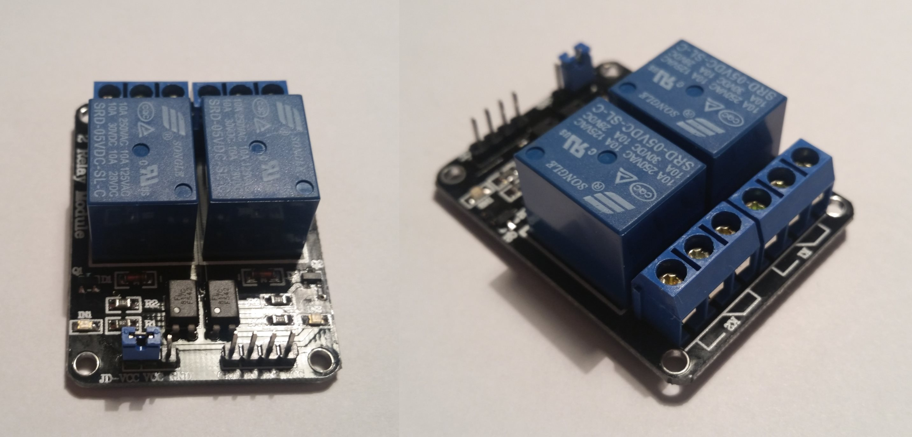

### 06. JSON and Relay Module (`06_JSON_2Relay`)

The previous example used plain text to transmit the LED state (`0` or `1`). This format does not easily extend when time comes to add more points of control or transmit sensor readings.

Lets look at using [JSON](https://pl.wikipedia.org/wiki/JSON) to represent the format of message communication.

Also for future extensibility we need to reflect on the message types and communication scheme. We surely need a way to handle more than just one LED. Also in the future we will want to handle stuff like IR transcievers or temperature sensors.

Since each of our IoT devices can have different sensors we also need a way to send this description (meta) information across to the control app. In the end the control web app needs knows what can it do with the device.

This JSON message can describe a device which has 2 LEDs and 1 switch:
```json
{
	"deviceId": "my_device_id",
	"features": [
		{
			"type": "led",
			"port": 1
		}, {
			"type": "led",
			"port": 2
		}, {
			"type": "switch",
			"port": 3
		}, {
			"type": "temperatureSensor",
			"port": 4
		}
	]
}
```

Ports represent virtual elements that the device has. Port is separate from the microcontroller PIN# as an endpoint device (e.g. temperature sensor) might use 3 pins to operate.

Another type of JSON message could be sent from the control app to turn the switch on:
```json
{
	"type": "switch",
	"port": 3,
	"on": true
}
```      

Finally the device could periodically send this JSON message to report the temperature sensor readings:
```json
{
	"type": "temperatureSensor",
	"port": 4,
	"deviceId": "my_device_id",
	"temperature": 23.5
}
```

Lets also introduce two REST API on the web app:

1. `/api/device/register` *(HTTP POST)*
	* The device *HTTP POST-s* the device description upon start (message #1).
2. `/api/device/{device_id}` *(HTTP GET)*
	* The device periodically *HTTP GET-s* the next command to execute from the control app (message #2).
	* If there is no pending command for the device to execute, the response payload will be empty (and *HTTP200*).
3. `/api/device/sensor` *(HTTP POST)*
	* The device periodically *HTTP POST-s* any sensor readings (message #3).

ToDo: Need a diagram.

We will start with the control app.

#### App (`06_JSON_2Relay_App`)

There is a test instance provisioned in Azure under http://iot-remotecontrol-2.azurewebsites.net.
This is a pretty standard ASP.NET app, so let's move on.

#### Device (`06_JSON_2Relay`)

[ArduinoJson](https://github.com/bblanchon/ArduinoJson) is a popular JSON serialization library. This will make working with JSON easy.

PlatformIO provides a way to install 3rd party libraries.
This is how you find and install a library into your project:

1. Go [PlatformIO Libraries Registry](http://platformio.org/lib)
2. Type `ArduinoJson` to find the library
3. Open the library page and navigate to *Installation* tab
4. Open the termminal (*PlatformIO > Terminal > Toggle*) and type:

	```
	platformio lib install 64
	```

	You will see something like this:
	```
	PS E:\dev\work\training_iot\06_RemoteControl_JSON_Device> platformio lib install 64
	Installing library [ 64 ]:
	Downloading...
	Unpacking...
	The library #64 'ArduinoJson' has been successfully installed!
	```
5. The library has been added to your project.
6. You need to reference the library in the source files (usual C stuff):

	```cpp
	#include <ArduinoJson.h>
	```

Lets check out the relevant code in `src\Main.cpp`. We reference the *ArduinoJson* library
```cpp
#include <ArduinoJson.h>
```

Note these declarations:
```cpp
// all LED1 constants
#define LED1_PIN 13
#define LED1_PORT 1

// all known feature types
#define FEATURE_TYPE_LED "led"
```

We have an utility method to *HTTP POST* JSON messages to the web app:
```cpp
bool postJson(const String& path, const String& postPayload)
{
  bool success = false;
  String url = String("http://") + server_host + path;

  Serial.printf("[HTTP] Connecting to %s\n", url.c_str());
  Serial.printf("[HTTP] Payload: %s\n", postPayload.c_str());

  HTTPClient http;
  http.begin(url);
  // tell the server we're posting JSON
  http.addHeader("Content-Type", "application/json");
  int httpCode = http.POST(postPayload);

	// ...

  http.end();
  return success;
}
```
Notice that we're using the `POST()` method from the `HTTPClient` and that we're specifying the `Content-Type` *HTTP* header.

We create the device description JSON message:
```cpp
String createDeviceDescriptionJson()
{
	StaticJsonBuffer<512> jsonBuffer;

  JsonObject& root = jsonBuffer.createObject();
  root["deviceId"] = device_id;
  JsonArray& features = root.createNestedArray("features");

  JsonObject& featureLed1 = jsonBuffer.createObject();
  featureLed1["type"] = FEATURE_TYPE_LED;
  featureLed1["port"] = LED1_PORT;

  features.add(featureLed1);

  char buffer[512];
  root.printTo(buffer, sizeof(buffer));
  return String(buffer);
}
```

This will produce the following device description JSON:
```json
{"deviceId":"my_device_id","features":[{"type":"led","port":1}]}
```

We use this along with the utility method to send the description message upon device start:
```cpp
bool registerDevice()
{
  auto msgJson = createDeviceDescriptionJson();
  return postJson("/api/device/register", msgJson);
}
```

Also there is another utility method to *HTTP GET* JSON messages from the web app:
```cpp
bool getJson(const String& path, String& payload)
{
  bool success = false;
  String url = String("http://") + server_host + path;
  Serial.printf("[HTTP] Connecting to %s\n", url.c_str());

  HTTPClient http;
  http.begin(url);

  int httpCode = http.GET();
  if (httpCode > 0)
  {
    // HTTP header has been send and Server response header has been handled
    Serial.printf("[HTTP] GET... code: %d\n", httpCode);

    // file found at server
    if (httpCode == HTTP_CODE_OK)
    {
      success = true;
      payload = http.getString();
      Serial.printf("[HTTP] Response: %s\n", payload.length() > 0 ? payload.c_str() : "(empty)");
    }
  }
  else
  {
    Serial.printf("[HTTP] GET... failed, error: %s\n", http.errorToString(httpCode).c_str());
  }

  http.end();
  return success;
}
```

The device pulls command messages from the web app using the utility method:
```cpp
bool popDeviceCommand(String& commandJson)
{
  String path = String("/api/device/") + device_id;
  // getJson succeeds and non-empty response payload
  return getJson(path, commandJson) && commandJson.length() > 0;
}
```

In the main `loop()` the device periodically pulls (*long polling*) and parses (deserializes) the inbound JSON message (command) from the web app:
```cpp
String commandJson;
// check if there is next command
if (popDeviceCommand(commandJson))
{
	// parse JSON command
	StaticJsonBuffer<256> jsonBuffer;
	JsonObject& command = jsonBuffer.parseObject(commandJson);
	if (!command.success())
	{
		Serial.println("parseObject() failed");
	}
	else
	{
		handleCommand(command);
	}
}

delay(2000);
```

Notice that we're keeping `commandJson` and `jsonBuffer` on the stack while the call to `handleCommand(command)` happens.
This is required because the actual `JsonObject` we pass as input argument points to parts of the memory used by these variables (see [Avoiding pitfalls ](https://github.com/bblanchon/ArduinoJson/wiki/Avoiding-pitfalls)).
This is an optimization the JSON library uses to have least memory footprint targeting small embedded processors.

The actual `handleCommand()` method handles the command and turns the LED on/off:
```cpp
// handle the incomming command
void handleCommand(JsonObject& command)
{
  // handle the command
  const char* type = command["type"].asString();
  const int port = command["port"].as<int>();
  if (strcmp(type, FEATURE_TYPE_LED) == 0)
  {
    // handle LED type
    const bool on = command["on"].as<bool>();
    if (port == LED1_PORT)
    {
      // handle LED on port 1
      digitalWrite(LED1_PIN, on ? HIGH : LOW);
    }
  }
}
```

It's time to run the sample. When the device starts in the *Serial Monitor* you should see:
```
Connecting to IoT_Network
..
WiFi connected
IP: 192.168.2.148
[HTTP] Connecting to http://iot-remotecontrol-2.azurewebsites.net/api/device/register
[HTTP] Payload: {"deviceId":"my_device_id","features":[{"type":"led","port":1}]}
[HTTP] POST... response code: 200, description:
[HTTP] Connecting to http://iot-remotecontrol-2.azurewebsites.net/api/device/my_device_id
[HTTP] GET... code: 200
[HTTP] Response: (empty)
[HTTP] Connecting to http://iot-remotecontrol-2.azurewebsites.net/api/device/my_device_id
[HTTP] GET... code: 200
[HTTP] Response: (empty)
```

Once the device sends its description to (registers itself with) the web app, we will see `my_device_id` device under the [Devices](http://iot-remotecontrol-2.azurewebsites.net/RemoteControl) menu. From there navigate to the control screen of the device to see the available options.

If were to press the *ON* button next to the LED label. This would cause the device to receive a LED-on command thus the LED would become turned on. We can see some tracing information in the *Serial Monitor* as well:
```
Connecting to http://iot-remotecontrol-2.azurewebsites.net/api/device/my_device_id
[HTTP] GET... code: 200
Response: {"on":false,"type":"led","port":1}
```

#### New Hardware Part: 2 Relay Module

The relay module allows us to open or close a circuit. The other circuit is isolated from the control circuit and can be of high voltage. We can use the module to drive a 230V/110V AC light bulb (or another device like a TV). Simply it acts as an switch that our ESP device can drive from the GPIO pins.

The module has 4 PINs:
* `Vcc` - for +5V
* `GND` - for GND
* `IN1` - is used to drive open/close the 1st relay
* `IN2` - is used to drive open/close the 2nd relay

When on `IN1`/`IN2` LOW signal is applied the relay keeps the circuit closed (e.g. light bulb on). Otherwise the relay makes the circuit open (e.g. light bulb off).
The other part of the relay module has 3 screws we can attach the other high voltage circuit.  



The module consists of 2 relays which are [opto-isolated](https://en.wikipedia.org/wiki/Opto-isolator). This provides electric protection for our ESP device. The module also has two small blue LEDs that become lit when a relay is on.   

Link to the [online store](http://elty.pl/pl/p/Modul-z-2-przekaznikami-z-transoptorami-/668).

##### Quick Exercise
Go ahead and connect the relay switch to +5V and GND. Connect the IN1/IN2 to GND to see that the respective relay becomes closed (and the status LED turns on).

#### Exercise

1. Add 2 more LEDs to the device (e.g. ports 2-3 and pins 12-14 respectively).
	* Since we have auto discovery, the device code should be the only place that requires an update.
2. Add support for `switch` feature.
	* Connect the relay module part to ports 4-5 and pins 4-5 respectively.
	* The web app already handles the `switch` type, so just update the device.
3. Add support for sending temperature data.
 	* See the #3rd type of message and the dedicated RESTful method.
	* For now send fake temperature every 5 seconds (use the [`millis()`](https://www.arduino.cc/en/Reference/Millis) method). We will connect the actual temperature sensor later on.
	* The web app already handles the `temperatureSensor` type, so just update the device.
	* Use the port 6 for the temperature sensor.

#### Reference
  * [ArduinoJson Encoding](https://github.com/bblanchon/ArduinoJson/wiki/Encoding-JSON)
  * [ArduinoJson Decoding](https://github.com/bblanchon/ArduinoJson/wiki/Decoding-JSON)
  * [ArduinoJson GitHub](https://github.com/bblanchon/ArduinoJson)
  * [`millis()`](https://www.arduino.cc/en/Reference/Millis)

#### Summary

* At this point we have a more robust message format (JSON) that allows for easy addition of ports and feature types (e.g. temperature sensors).
* Currently we handle two types of features (switch, LED, temperature sensor) and can have many instances of each.
* The device announces its capabilities to the web app, thus the manual pairing is not needed.
* (ToDo) The device application needs some refactoring:
	* We need to encapsulate each feature in its own class. This would also allow us to put configuration like the port # and pin # together.
	* The device settings (e.g. network/password) needs a class of its own.
	* The code should be broken into multiple files/classes.
* (ToDo) We still need to think about:
	* Replacing *long polling* over HTTP with better scalable communication.
	* Security
