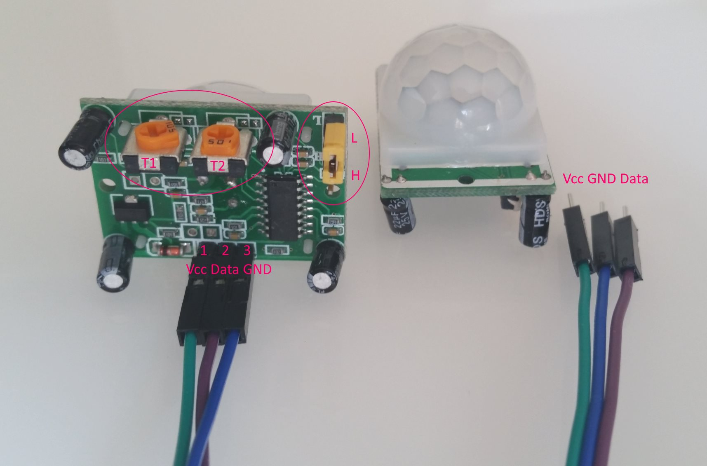

## 08. Temperature/Humidity and Motion Sensors  (`08_Temp_Motion`)

In this exercise we will:
* Connect an actual temperature and humidity sensor (DHT-22).
* Connect an motion sensor (PIR HC-SR501).
* Push sensor readings to the web app.
* Apply some refactor to the previous device code in order to improve the app architecture.

The web app version from `06_JSON_2Relay_App` will be used.
The device code is in `08_Temp_Motion`.

### Refactoring

Up until now most of the code was more procedural C than object oriented C++. Also our solution now is capable of handling many endpoint types.

ToDo

Running the device sketch:

```
[MainApp] Connecting to IoT_Network
..
[MainApp] WiFi connected
[MainApp] IP: 192.168.2.148
[MainApp] Starting...
[MainApp] Sending DeviceDescription...
[HTTP] Connecting to http://iot-remotecontrol-2.azurewebsites.net/api/device/register
[HTTP] Payload: {"deviceId":"my_device_id","features":[{"type":"switch","port":4},{"type":"switch","port":5},{"type":"led","port":1},{"type":"led","port":2},{"type":"led","port
":3}]}
[HTTP] POST... response code: 200, description:
[MainApp] Started.
```

You can control the device from the test web app: http://iot-remotecontrol-2.azurewebsites.net/

### New Hardware Part: DHT-22 - Humidity and Temperature Sensor

The DHT-22 is a low cost humidity and temperature sensor with a single wire digital interface.
DHT-22 Specs:
* 3.3-6V Input
* 1-1.5mA measuring current
* 40-50 uA standby current
* Humidity from 0-100% RH
* -40 - 80 degrees C temperature range
* +/- 2% RH accuracy
* +/- 0.5 degrees C


DHT-22 pins from left to right:

Pin | Function
----|----------
1   | Vcc - power supply (3.3V)
2   | Data - signal
3   | NULL (not used)
4   | GND

The `Data` pin needs to be connected to `Vcc` via a pull up resistor (10K Ohm).

Link to the [online store 1](http://elty.pl/pl/p/Czujnik-wilgotnosci-DHT22-AM2302/285) and [online store 2](https://botland.com.pl/content/142-arduino-i-obsluga-czujnika-temperatury-i-wilgotnosci-dht22).

#### Library

There are few libraries to work with the DHT-22 sensor. The [DHT sensor library](http://platformio.org/lib/show/19/DHT%20sensor%20library) from Adafruit works and is well documented.

Open the provided link to view an example how to use it.

#### Exercise 1

Push humidity/temperature readings to web app:
  * Connect the DHT-22 sensor:
    * Use GPIO pin `12` to connect DHT-22 data pin.
    * Connect `Vcc` to `+3.3V` voltage.
  * Install library via *Library Manager*: `platformio lib install "DHT sensor library"`.
  * Add the relevant `DHT22FeatureController` class and register an instance in the `MainApp` constructor.
    * Notice we have one feature controller to measure both temperature and humidity.
    * Use the controller class `Loop()` method to read the sensor and send out messages to topic `sensor`.
    * Use port `6`.
  * Push the data every 10 seconds.
    * Use the `TimeUtil::IntervalPassed()` method to avoid blocking the application loop.
    * After each 10 second interval send only one humidity or temperature e.g.: 10s, temp, 10s, humidity, 10s, temp, 10s, humidity.
  * The web app already understands `temperatureSensor` and `humiditySensor` feature types.

To recall from laboratory `06_JSON_2Relay`, the temperature/humidity sensor reading JSON are:

```json
{
	"type": "temperatureSensor",
	"port": 6,
	"deviceId": "my_device_id",
	"temperature": 23.5
}
```

```json
{
	"type": "humiditySensor",
	"port": 6,
	"deviceId": "my_device_id",
	"humidity": 43.4
}
```


### New Hardware Part: PIR HC-SR501 - Motion Sensor

Specs

* 4.5-20V DC Input
* Current 50uA
* Output signal 0,3V or 5V
* Field of view 110 degree
* Max Distance 7m



PIR HC-SR501 pins from left to right:

Pin | Function
----|----------
1   | Vcc - power supply
2   | Out - HIGH when movement detected, otherwise LOW
3   | GND

The sensor has some customization:
* `T1` - duration of HIGH when motion detected.
* `T2` - sensitivity of sensor (distance).
* `H` - (mode) keeps `Out` HIGH while motion is happening
* `L` - (mode) keeps `Out` HIGH only during first movement detection.

Link to the [online store 1](https://botland.com.pl/czujniki-ruchu/1655-czujnik-ruchu-pir-hc-sr501.html) and [online store 2](http://elty.pl/pl/p/Czujnik-ruchu-PIR-HC-SR501/264).

#### Exercise 2

Push motion events to web app:
  * Connect the motion sensor:
    * Use GPIO pin `14` to connect sensor `Out` pin.
    * Connect `Vcc` to `+3.3V` voltage.
  * Add the relevant `MotionFeatureController` class and create and instance inside the `MainApp` constructor.
    * Use the controller class `Loop()` method to read the sensor and send out messages to topic `sensor`.
    * Use port `7`.
  * Push the data onlu on state change and not often than every 3 seconds.
    * Use the `TimeUtil::IntervalPassed()` method to avoid blocking the application loop.
  * The web app already understands `motionSensor` feature types.

The motion message that the web app understands:

```json
{
	"type": "motionSensor",
	"port": 7,
	"deviceId": "my_device_id",
	"motion": true
}
```

Make sure to send this to the `sensor` topic (same as for the temperature/humidity readings).
