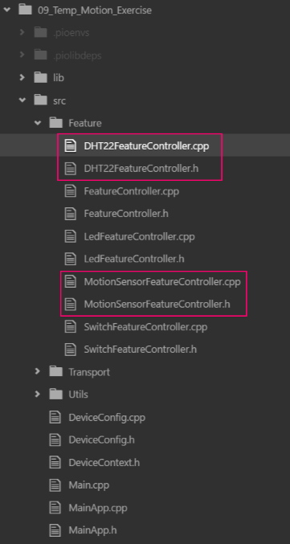
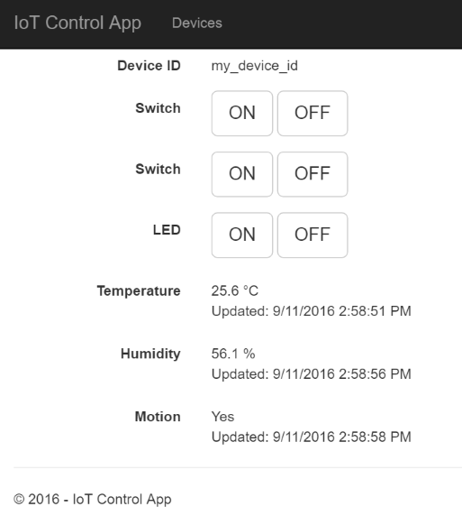

## 09. Exercise from (`08_Temp_Motion`)

The connections for our ESP on breadboard:

ESP GPIO | Port | What
---|---|---------------
13 | 1 | LED (with resistor)
12 | 6 | Temperature sensor `Data` pin
14 | 7 | Motion sensor `Out` pin
 4 | 4 | `IN1` from 2-Relay Module
 5 | 5 | `IN2` from 2-Relay Module

We added 2 new classes:
* `DHT22FeatureController`
* `MotionFeatureController`



Upon program start:

```
[MainApp] Connecting to IoT_Network
..
[MainApp] WiFi connected
[MainApp] IP: 192.168.2.109
[MainApp] Starting...
Sending DeviceDescription...
[HTTP] Connecting to http://iot-remotecontrol-2.azurewebsites.net/api/device/register
[HTTP] Payload: {"deviceId":"my_device_id","features":[{"port":4,"type":"switch"},{"port":5,"type":"switch"},{"port":1,"type":"led"},{"port":6,"type":"tempe
ratureSensor"},{"port":6,"type":"humiditySensor"},{"port":7,"type":"motionSensor"}]}
[HTTP] POST... response code: 200, description:
[MainApp] Started.
```

Notice the description JSON being send:

```json
{
	"deviceId": "my_device_id",
	"features": [{
		"port": 4,
		"type": "switch"
	},
	{
		"port": 5,
		"type": "switch"
	},
	{
		"port": 1,
		"type": "led"
	},
	{
		"port": 6,
		"type": "temperatureSensor"
	},
	{
		"port": 6,
		"type": "humiditySensor"
	},
	{
		"port": 7,
		"type": "motionSensor"
	}]
}
```

The temperature and humidity readings are published:

```
[DHT22] Humidity: 65 %
[HTTP] Connecting to http://iot-remotecontrol-2.azurewebsites.net/api/device/sensor
[HTTP] Payload: {"port":7,"deviceId":"my_device_id","type":"humiditySensor","humidity":65.30}
[HTTP] POST... response code: 200, description:
```

```
[DHT22] Temperature: 23 C
[HTTP] Connecting to http://iot-remotecontrol-2.azurewebsites.net/api/device/sensor
[HTTP] Payload: {"port":7,"deviceId":"my_device_id","type":"temperatureSensor","temperature":23.80}
[HTTP] POST... response code: 200, description:
[HTTP] Connecting to http://iot-remotecontrol-2.azurewebsites.net/api/device/my_device_id
```

Similar for the motion readings:

```
[MotionSensor] Motion: 1
[HTTP] Connecting to http://iot-remotecontrol-2.azurewebsites.net/api/device/sensor
[HTTP] Payload: {"port":7,"deviceId":"my_device_id","type":"motionSensor","motion":true}
[HTTP] POST... response code: 200, description:
```

The web app displays all the current readings:


