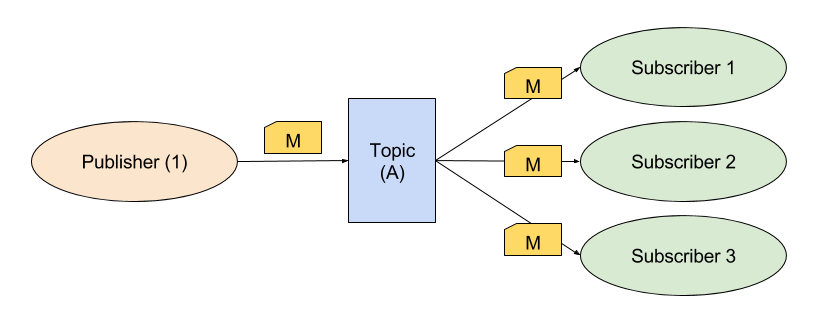
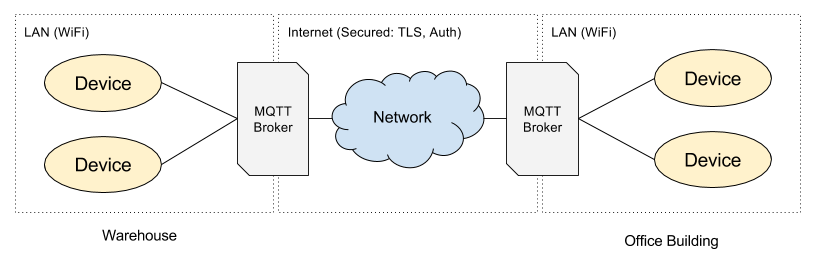

### 09. MQTT Broker (`09_MQTT`)
This step ports the previous version to the MQTT protocol which is more robust than long-polling over HTTP.

#### MQTT

MQTT has been designed with the IoT systems in mind. It is lightweight, so that low memory systems can easily use it.

Some details about [MQTT](http://mqtt.org):
* Message Queuing Telemetry Transport (MQTT)
* Machine-to-machine (M2M) / "Internet of Things" connectivity protocol
* Extremely lightweight publish/subscribe messaging transport
* Built on TCP/IP
* OASIS Standard

[Pub/sub messaging](https://en.wikipedia.org/wiki/Publish%E2%80%93subscribe_pattern) is a messaging pattern that allows the system to scale out.


#### Worth reading (at home)

There is a good set of articles about [MQTT Essentials](http://www.hivemq.com/blog/mqtt-essentials/) from [HiveMQ](http://www.hivemq.com/).

#### MQTT Broker (Mosquitto)

We will use [Mosquitto](https://mosquitto.org/) as the MQTT broker. It is super easy to use, lightweight and open-source. You can even run it on your Raspberry Pi.

Mosquitto (and other brokers) supports bridging. This means many broker instances can be connected. That allows seamless connections of local IoT networks into larger networks.



The bridge can be secured in many ways:
* TLS
* Authentication
* ACL policies in place.

### Device

[PubSubClient](http://platformio.org/lib/show/89/PubSubClient) - C++ client library is used to connect with MQTT from the ESP device. See [API Documentation](http://pubsubclient.knolleary.net/api.html).

Installing the PubSubClient in PlatformIO:
```
PS E:\dev\work\training_iot\10_MQTT> platformio lib install "PubSubClient"
Library Storage: E:\dev\work\training_iot\10_MQTT\.piolibdeps
Looking for PubSubClient library in registry
Found: http://platformio.org/lib/show/89/PubSubClient
LibraryManager: Installing id=89
Downloading...
Unpacking...
PubSubClient @ 2.6 has been successfully installed!
```

The sample was implemented from:
https://github.com/knolleary/pubsubclient/blob/master/examples/mqtt_esp8266/mqtt_esp8266.ino

Files that have been added and modified:
```
src/Feature/FeatureController.cpp
src/Feature/FeatureController.h
src/Transport/MqttMessageBus.cpp (+)
src/Transport/MqttMessageBus.h (+)
src/MainApp.cpp
src/MainApp.h
```

Running the device program outputs:

```
[MainApp] Connecting to IoT_Network
..
[MainApp] WiFi connected
[MainApp] IP: 192.168.2.109
[MainApp] Starting...
[MainApp] Started.

[MQTT] Attempting MQTT connection (ClientId: my_device_id-b936)...
[MQTT] Connected
[MQTT] Subscribing to topic: 'my_device_id'
[MainApp] Sending DeviceDescription...
[MQTT] Publish to topic: 'register', message: '{"deviceId":"my_device_id","features":[{"port":4,"type":"switch"},{"port":5,"type":"switch"},{"port":1,"type":"led"},{"port
":6,"type":"temperatureSensor"},{"port":6,"type":"humiditySensor"},{"port":7,"type":"motionSensor"}]}'
[DHT22] Humidity: 59 %
[MQTT] Publish to topic: 'sensor', message: '{"port":6,"deviceId":"my_device_id","type":"humiditySensor","humidity":59.80}'
[DHT22] Temperature: 25 C
[MQTT] Publish to topic: 'sensor', message: '{"port":6,"deviceId":"my_device_id","type":"temperatureSensor","temperature":25.00}'
```

```
pi@raspberrypi ~ $ mosquitto_sub -t register -t sensor
{"port":6,"deviceId":"my_device_id","type":"humiditySensor","humidity":59.80}
{"port":6,"deviceId":"my_device_id","type":"temperatureSensor","temperature":25.00}
{"port":6,"deviceId":"my_device_id","type":"humiditySensor","humidity":59.80}
@raspberrypi ~ $ mosquitto_sub -t register -t sensor
{"port":6,"deviceId":"my_device_id","type":"humiditySensor","humidity":59.80}
{"port":6,"deviceId":"my_device_id","type":"temperatureSensor","temperature":25.00}
{"port":6,"deviceId":"my_device_id","type":"temperatureSensor","temperature":25.00}
{"port":6,"deviceId":"my_device_id","type":"humiditySensor","humidity":59.90}
{"port":6,"deviceId":"my_device_id","type":"temperatureSensor","temperature":25.00}
```

Using Mosquitto's CLI client we can subscribe to selected topics to view the messages passed around (see [mosquitto_sub](https://mosquitto.org/man/mosquitto_sub-1.html)):
```
$ mosquitto_sub -t register -t sensor -t my_device_id
```

Alternative we could also use [MyMQTT](https://play.google.com/store/apps/details?id=at.tripwire.mqtt.client) (an android app) to view the traffic.

### Control Web App

[M2Mqtt](https://www.nuget.org/packages/M2Mqtt/) is a .NET client library which is used in the control web app. See [API Documentation](https://m2mqtt.wordpress.com/using-mqttclient/).

We use the version from `06_JSON_2Relay_App`.
When run locally it will use the MQTT transport - see the `Web.config`:

```xml
<appSettings>
  <add key="MqttBrokerHost" value="192.168.2.120"/>
  <add key="MqttBrokerPort" value="1883"/>
  <!-- MQTT or HTTP -->
  <add key="TransportMode" value="MQTT"/>
</appSettings>
```

### Exercise

We want to reflect the connectivity state of our device (if it's online/offline) and make this available to other devices:

1. Add retain message `my_device_id/status` (on device start)
  ```json
  {
    "online": true
  }
  ```

2. Add LWT message on `my_device_id/status`

  ```json
  {
    "online": false
  }
  ```
