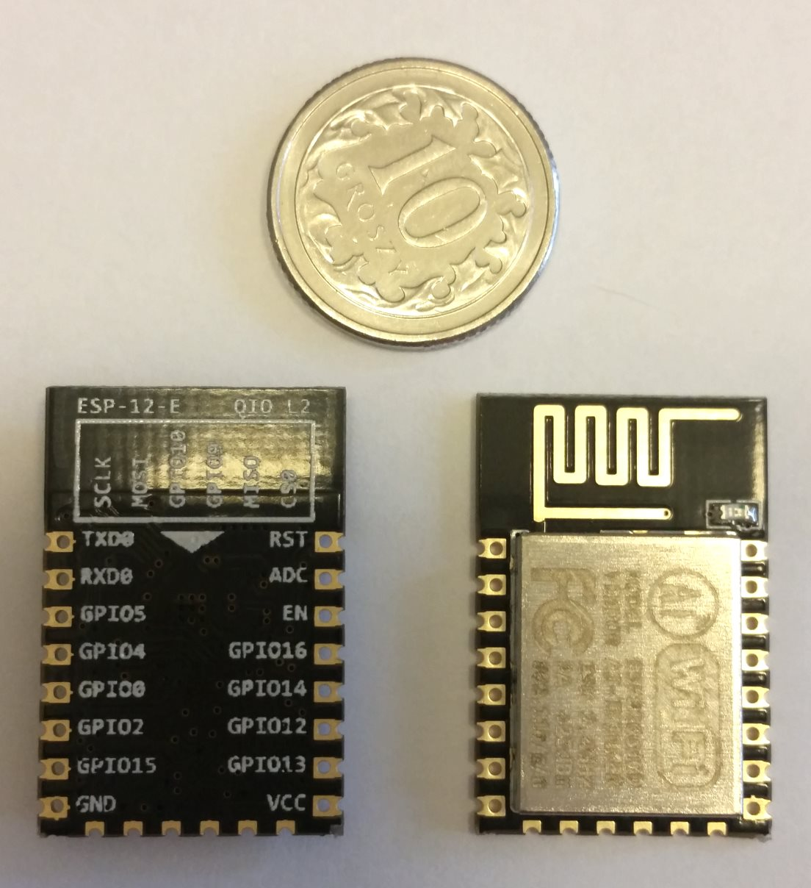
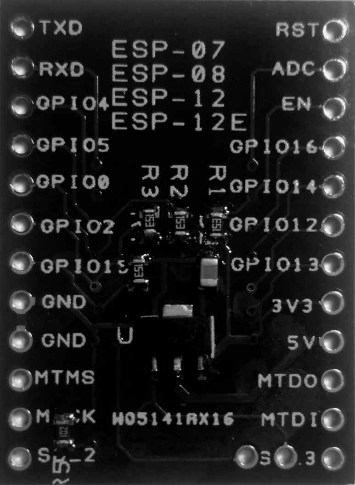

## Intro

Workshop materials for the IoT hand-on training. The training is based on the [ESP8266](http://espressif.com/en/products/hardware/esp8266ex/overview) chip and [Arduino](https://github.com/esp8266/Arduino) framework.
The training was first done at the [TWF 2016 Conference](http://twf.community).

The idea behind the workshop is to have a step-by-step tutorial on building *Internet of Things (IoT)* solutions.
The initial exercises are simple and evolve over time.

If any questions please email me.

## Resources

* [ESP8266 Community Forum](http://www.esp8266.com/)
* [Arduino core for ESP8266 WiFi chip](https://github.com/esp8266/Arduino)
* [Arduino Reference](https://www.arduino.cc/en/Reference/HomePage)
* [esp8266-wiki](https://github.com/esp8266/esp8266-wiki/wiki)
* [Arduino Tutorials](https://www.arduino.cc/en/Tutorial/BuiltInExamples)

## Prerequisites

#### Software

Ensure you have installed:
* [PlatformIO](http://platformio.org/) IDE (for the IoT device)
	* Download from: http://platformio.org/platformio-ide
	* Also follow the [installation guide](http://docs.platformio.org/en/stable/ide/atom.html#installation)
		* Ensure you install *clang* to have code completion.
		* Ensure you install Python.
* [Visual Studio 2015 Community](https://www.visualstudio.com/en-us/products/visual-studio-community-vs.aspx) IDE (for the control app)

Windows PC is required.

#### Hardware Checklist

The training requires parts:
* Chip
	* Module WiFi ESP-12E ESP8266 Black - 11 GPIO, ADC, PCB antenna
	* Adapter board ESP8266 ESP-12 / 12E / 12F / 07
* USB-UART (flasher)
	* Converter USB-UART PL2303 - microUSB slot
	* MicroUSB cable B-A
* Sensors
	* Motion detector PIR HC-SR501
	* Transmitter IR 5mm 940nm (TSAL6400)
	* Infrared Receiver 38 kHz (TSOP4838)
	* Humidity detector DHT22 AM2302
	* Module with 2 relays (photo-optic isolation)
* Power
	* Stabilizer LDO 3.3V LF33CV - THT TO220
	* Power adapter 5V/2A DC
* Other stuff
	* Breadboard
	* Male wires
	* 3x LEDs (red, yellow, green)
	* 4x 220&#937; resistor
	* 1x 100&#937; resistor
* Computer (PC, MAC?)

## Essentials

### PlatformIO

Most important commands in PlatformIO:
* **Serial Monitor**
	* PlatformIO > Serial Monitor
	* Shortcut: **Alt+Shift+M**
* **Build**
	* PlatformIO > Build
	* Shortcut: **Alt+Ctrl+B**
* **Upload**
	* PlatformIO > Upload
	* Shortcut: **Alt+Ctrl+U**


### ESP8266

#### Boot Modes
Whenever the ESP is reset or powered on it checks the state of three GPIO pins to enter one of the boot modes:

GPIO15|GPIO0|GPIO2|Mode
------|-----|-----|----
   LOW|  LOW| HIGH|UART Bootloader
   LOW| HIGH| HIGH|Boot sketch
  HIGH|    x|    x|SDIO mode (not used for Arduino)

* LOW = connected to GND
* HIGH = connected to 3.3V

The *UART Bootloader* mode is used to upload our program.
The *Boot sketch* mode is used to execute our program (normal mode).

At startup ESP prints out the current boot mode:
```
rst cause:2, boot mode:(3,6)
```

More details are provided on the [ESP Arduino wiki](https://github.com/esp8266/Arduino/blob/master/doc/boards.md#boot-messages-and-modes).

#### Layout

The ESP8266 12E looks like this:



During the workshop we are sing a breadboard adapter:



## Instructions

* [01_Blink](01_Blink.md)
* [02_Blink_SOS](02_Blink_SOS.md)
* [03_Blink_3LED](03_Blink_3LED.md)
* [04_WiFi](04_WiFi.md)
* [05_RemoteControl](05_RemoteControl.md)
* [06_JSON_2Relay](06_JSON_2Relay.md)
* [07_JSON_2Relay_Exercise](07_JSON_2Relay_Exercise.md)
* [08_Temp_Motion](08_Temp_Motion.md)
* [09_Temp_Motion_Exercise](09_Temp_Motion_Exercise.md)
* [10_MQTT](10_MQTT.md)
* [11_MQTT_Exercise](11_MQTT_Exercise.md)
* [12_IR](12_IR.md)
* [13_IR_Exercise](13_IR_Exercise.md)

## Worth investigating

* [Eclipse SmartHome](https://www.eclipse.org/smarthome/index.html) project
* [Eclipse IoT](http://iot.eclipse.org/) technology hub

## Extras

[Additional information](20_Extras.md)

## Notes

* Schematics are prepared using [Fritzing](http://fritzing.org/home/).

##### License
TBD

##### Legal Notes
1. This material is provided as is.
2. The author is not responsible for any damage this might cause ;-)
