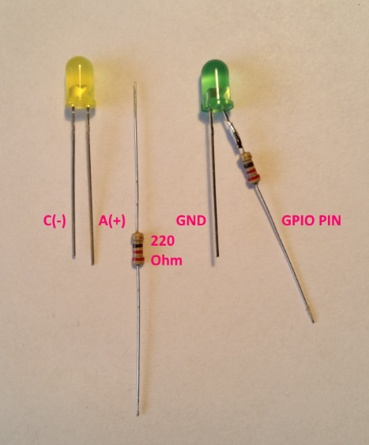
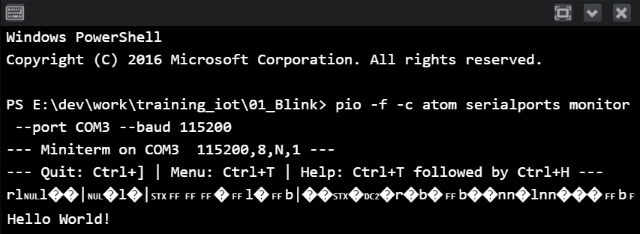

## Intro

Workshop materials for the IoT hand-on training. The training is based on the [ESP8266](http://espressif.com/en/products/hardware/esp8266ex/overview) chip and [Arduino](https://github.com/esp8266/Arduino) framework.
The training was first done at the [TWF 2016 Conference](http://twf.community).

The idea behind the workshop is to have a step-by-step tutorial on building *Internet of Things (IoT)* solutions. The initial exercses are simple and evolve over time.

If any questions please email me.

## Resources

* [ESP8266 Community Forum](http://www.esp8266.com/)
* [Arduino core for ESP8266 WiFi chip](https://github.com/esp8266/Arduino)
* [Arduino Reference](https://www.arduino.cc/en/Reference/HomePage)
* [esp8266-wiki](https://github.com/esp8266/esp8266-wiki/wiki)
* [Arduino Tutorials](https://www.arduino.cc/en/Tutorial/BuiltInExamples)

## Prerequisites

#### Software

Ensure you have installed:
* [PlatformIO](http://platformio.org/) IDE for the IoT device
* [Visual Studio 2015 Community](https://www.visualstudio.com/en-us/products/visual-studio-community-vs.aspx) IDE for the control app

#### Hardware

The training requires parts:
* Chip
	* Module WiFi ESP-12E ESP8266 Black - 11 GPIO, ADC, PCB antenna
	* Adapter board ESP8266 ESP-12 / 12E / 12F / 07
* USB-UART (flasher)
	* Converter USB-UART PL2303 - microUSB slot
	* MicroUSB cable B - A - Esperanza - 0,8m
* Sensors
	* Motion detector PIR HC-SR501
	* Transmitter IR LIRED5C-850 5mm 850nm
	* Infrared Receiver TSOP4838 - 38 kHz
	* Humidity detector DHT22 AM2302
	* Module with 2 relays (photooptic isolation)
* Power
	* Stabilizer LDO 3,3V LF33CV - THT TO220
	* Power adapter 5V / 1,2A - DC 5,5/2,5mm
* Other stuff
	* Breadboard
	* Male wires
	* 3x LEDs (red, yellow, green)
	* 3x 220&#937; resistor
* Computer (PC, MAC?)

## Notes

* Schematics are prepared using [Fritzing](http://fritzing.org/home/).

##### License
TBD

##### Legal Notes
1. This material is provided as is.
2. The author is not responsible for any damage this might cause ;-)

## Essentials

### Boot Modes
Whenever the ESP is reset or powered on it checks the state of three GPIO pins to enter one of the boot modes:

GPIO15|GPIO0|GPIO2|Mode
------|-----|-----|----
    0V|   0V| 3.3V|UART Bootloader
    0V| 3.3V| 3.3V|Boot sketch
  3.3V|    x|    x|SDIO mode (not used for Arduino)

The *UART Bootloader* mode is used to upload our program.
The *Boot sketch* mode is used to execute our program (normal mode).

At startup ESP prints out the current boot mode:
```
rst cause:2, boot mode:(3,6)
```

More details are provided on the [ESP Arduino wiki](https://github.com/esp8266/Arduino/blob/master/doc/boards.md#boot-messages-and-modes).

## Instructions

### 01_Blink

This is a traditional *Hello World* sample for the *ESP8266* board and *Arduino* framework. The sample turns on/off a LED using a GPIO pin and prints the famous `Hello World!`.

#### Objectives
* Learn to use PlatformIO.
* Understand the basic program structure.
* Learn how to connect ESP8266 and how to upload a program (flash).
* Learn how to use GPIO pins to drive a LED.

#### Hardware

First lets connect the hardware...


Connections of ESP8266 pins:
* `RST` of ESP8266 connected via a push switch to `LOW`.
  * When the button gets pressed it will restart our program (and the chip).
* `EN` is connected to `HIGH` to *enable* the chip.
  * The chip enters *sleep mode* if connected to `LOW` (or not connected at all).  
  * *Sleep mode* is used to lower the power consumption.
* `GND` and `3V3` is connected to `GND` and voltage `3.3V` respectively.      

The sample program will blink a LED. The LED's cathode (shorter leg) is connected to `GND` and the anode is connected via a 220&#937; resistor to the GPIO pin `#13`. The resistor is needed to limit the current on the LED (not to burn it).



#### Software

The structure of the project files comes from the [Platform IO](http://platformio.org/). The underlying programming language is C++. The most interesting part of the sample is located in the main program file `src\Main.cpp`:

```cpp
// reference the arduino framework
#include <Arduino.h>

// the LED's GPIO pin number
#define LED 13

void setup()
{
  // initialize serial communication
  Serial.begin(115200);

  Serial.println("");
  Serial.println("Hello World!");
  Serial.println("");

  // initialize LED digital pin as an output.
  pinMode(LED, OUTPUT);
}

void loop()
{
  // turn the LED on (HIGH is the voltage level)
  digitalWrite(LED, HIGH);
  // wait for a second
  delay(1000);
  // turn the LED off by making the voltage LOW
  digitalWrite(LED, LOW);
   // wait for a second
  delay(1000);
}
```
The name of the main file can be whatever you like, but it needs to have a meaningful C++ extension (e.g. `.cpp` or `.c`) and has to be located under `src` folder.

Some explanation on the code...

Any program should have exactly one `setup()` and `loop()` functions defined. The `setup()` is executed only once - when the chip starts (when powered or reset); after that `loop()` is executed repeatedly.

The `#include <Arduino.h>` brings in all the Arduino framework functions.

The `Serial` enables us to send (and recieve) some characters into the `Serial Monitor`. This is useful to output diagnostic information to debug our program.

Lets run the program:
* Compile using PlatformIO
* Put the ESP into *UART Boatloader* mode
	* Set `GPIO0` to *PullDown*
	* Press `RESET` button briefly
* Upload program using PlatformIO
* Open `Serial Monitor` in PlatformIO
* Set `GPIO0` to loose (or *PullUp*)
* Press `RESET` button briefly

When all is successful the LED will blink and the output from the *Serial Monitor* will have the `Hello World!` line:



#### Arduino Reference
* [`pinMode(pin, mode)`](https://www.arduino.cc/en/Reference/PinMode)
* [`digitalWrite(pin, value)`](https://www.arduino.cc/en/Reference/DigitalWrite)
* [`delay(ms)`](https://www.arduino.cc/en/Reference/Delay)
* [`setup()`](https://www.arduino.cc/en/Reference/Setup)
* [`loop()`](https://www.arduino.cc/en/Reference/Loop)
* [`Serial.begin()`](https://www.arduino.cc/en/Serial/Begin)
* [`Serial.print()`](https://www.arduino.cc/en/Serial/Print)

#### Worth reading (at home)

* [Diode and LED Polarity](https://learn.sparkfun.com/tutorials/polarity/diode-and-led-polarity)

#### Exercise

1. Connect the hardware parts and upload the program to ESP.
	* Connect the USB-TTL converter.
	* Open the `01_blink` project in PlatformIO.
	* Build / Upload (ensure ESP is in upload mode).
2. Modify the program to make the LED emit [SOS signal](https://en.wikipedia.org/wiki/SOS) (`...---...`)
  * Change & upload the program.
3. Blink 3 LEDs one after another
  * Connect 2 more LEDs (green and yellow) to GPIO pins `#16` and `#12`.
  * Change and upload the program.

### 02_Blink_SOS

This an example for solving exercise *#2* from the *01_Blink* section.

#### Objectives
* Exercise the program upload

### 03_Blink_3LED

This an example for solving exercise *#3* from the *01_Blink* section.


#### Objectives
* Exercise the program upload
* Exercise the LED connection

### 04_WiFi

ESP8266 has a built in WiFi module. We can interface with it using the WiFi library. The ESP WiFi can work in one of the 3 modes:
* access point,
* client,
* mixed (both AP and client).

This sample connects to the specified secured network and prints out the IP/MAC address of the ESP. It also uses a LED to indicate the connection status - when lit the WiFi connection is established.

Here is the program:

```cpp
#include <Arduino.h>
// reference the ESP WiFi headers
#include <ESP8266WiFi.h>

#define STATUS_LED 13

// update with you network SSID and password
const char* ssid     = "IoT_Network";
const char* password = "IoT_Password";

void connectToNetwork() {
  Serial.println();
  Serial.println();
  Serial.print("Connecting to ");
  Serial.println(ssid);

  // Connect to a WiFi network
  WiFi.begin(ssid, password);
  // Wait until the connection is established
  while (WiFi.status() != WL_CONNECTED) {
    delay(500);
    Serial.print(".");
  }

  Serial.println("");
  Serial.println("WiFi connected");
}

void setup()
{
  // connect the serial port
  Serial.begin(115200);

  pinMode(STATUS_LED, OUTPUT);
  // LED off - will indicate we're not connected to WiFi yet
  digitalWrite(STATUS_LED, LOW);

  connectToNetwork();

  // LED on - will indicate that we're connected
  digitalWrite(STATUS_LED, HIGH);

  // print the IP address
  IPAddress ip = WiFi.localIP();
  Serial.println("IP address: ");
  Serial.println(ip);

  // print the MAC address
  byte mac[6];
  WiFi.macAddress(mac);
  Serial.println("MAC address: ");
  for (int i = 5; i >= 0; i--)
    Serial.print(mac[i], HEX);

  Serial.println("");
}

void loop()
{
	delay(50);
}
```

When the program runs the *Serial Monitor* outputs:
```
Connecting to IoT_Network
..
WiFi connected
IP address:
192.168.2.148
E42D897FCF5C
```

#### Arduino Reference
* [`WiFi.begin()`](https://www.arduino.cc/en/Reference/WiFiBegin)
* [`WiFi.status()`](https://www.arduino.cc/en/Reference/WiFiStatus)
* [`WiFi.localIP()`](https://www.arduino.cc/en/Reference/WiFiLocalIP)
* [`WiFi.macAddress()`](https://www.arduino.cc/en/Reference/WiFiMACAddress)

#### Worth reading at home
* [WiFi Library (Arduino)](https://www.arduino.cc/en/Reference/WiFi)
* [ESP Arduino Examples on GitHub](https://github.com/esp8266/Arduino/tree/master/libraries/ESP8266WiFi/examples)
* [Serial Reference](https://www.arduino.cc/en/Reference/Serial)

### 05_RemoteControl

The example consists of two apps:
* client: ESP device with a connected LED (C++)
* server: WebApp that controls the LED remotely (C#, ASP.NET, Web)

This example shows how to communicate with a remote host over TCP/IP. Specifically the client (ESP device) will connect with the remote web app over HTTP and pull the device state ([long polling](https://en.wikipedia.org/wiki/Push_technology#Long_polling)).
This minimal setup will allow us to drive a LED on the ESP device remotely (e.g. from outside of the building).

Here is the conceptual diagram:

ToDo: diagram needed

We need to agree on the communication scheme between the ESP device and our WebApp:
* *HTTP* protocol will be used as transport layer
* The device will pull the LED state (on/off state) every second from the server.
* The device will know the host of the WebApp
* The LED state will be represented as character `0` for off and `1` for on.

Lets start with the web app first...

#### 05_RemoteControl_App - control web app

The WebApp exposes two *RESTful* methods:

1. `http://{host}/api/device/{device_id}/state`
	* Responds with the {state} of the device `{my_device_id}`.
	* The response is `plain/text` encoded in `ASCII`.
	* The values returned will be - either `0` or `1`.
2. `http://{host}/api/device/{device_id}/?state={state}`
	* Allows us to set the `{state}` for `{my_device_id}`.  

The ESP device will use the #1st method to pull the state.
Notice that the WebApp does not know about the devices until they first connect via the *RESTful API* (#1st method).

The WebApp has been deployed to an Azure Website: http://iot-remotecontrolapp.azurewebsites.net. We can use it for testing:
0. Fetch the state of `my_device_id` device from the test server:
1. http://iot-remotecontrolapp.azurewebsites.net/api/device/my_device_id/state
2. Returns: `0`
3. We can now set the state to `1`:
4. http://iot-remotecontrolapp.azurewebsites.net/api/device/my_device_id/?state=1
5. Then a call to
6. http://iot-remotecontrolapp.azurewebsites.net/api/device/my_device_id/state
7. Returns: `1`

The rest of the WebApp is not that interesting, so let's move on to the client device (ESP).

#### 05_RemoteControl - client device

ToDo

In the sample we have used the `HTTPClient` which makes it easy to work with `HTTP` protocol. ESP Arduino also makes it possible to use the low level *Socket* API (see [`WiFiClient`](https://github.com/esp8266/Arduino/tree/master/libraries/ESP8266WiFi/examples/WiFiClient)).

When the program starts it pulls the device state from the test WebApp. Any change done in the WebApp is also reflected in the device's LED:
```
Connecting to http://iot-remotecontrolapp.azurewebsites.net/api/device/my_device_id/state
[HTTP] GET... code: 200
Response:
0
Closing connection

Connecting to http://iot-remotecontrolapp.azurewebsites.net/api/device/my_device_id/state
[HTTP] GET... code: 200
Response:
1
Closing connection
```

Note that the program checks if the WiFi network is disconnected. When the WiFi router is unplugged:
```
Connecting to http://iot-remotecontrolapp.azurewebsites.net/api/device/my_device_id/state
[HTTP] GET... failed, error: connection refused
Closing connection

WiFi not connected.
WiFi not connected.
```

Then when you plug it in again it will work fine again. The `WiFi` class joins the network once available.  

#### Reference

* [`HTTPClient` Examples (ESP Arduino)](https://github.com/esp8266/Arduino/tree/master/libraries/ESP8266HTTPClient)
* [`WiFiClient` Examples (ESP Arduino)](https://github.com/esp8266/Arduino/tree/master/libraries/ESP8266WiFi/examples/WiFiClient)
* [`WiFiClient` Arduino Reference](https://www.arduino.cc/en/Reference/WiFiClient)

### TODO Next example

TODO

## Extras

### Exeptions

Sometime the program causes runtime errors that cause the chip to reboot and enter invalid state. ESP provides some diagnostic information when an error happens:

```
Exception (28):
epc1=0x40221a46 epc2=0x00000000 epc3=0x00000000 excvaddr=0x00000000 depc=0x00000000

ctx: sys
sp: 3ffff850 end: 3fffffb0 offset: 01a0

>>>stack>>>
3ffff9f0:  00000001 00000004 3ffe99b4 00000002
...
3fffffa0:  400201e9 efac3ebe ffffff01 55aa55aa
<<<stack<<<
```

See the list of exceptions [Exception Causes (EXCCAUSE)](https://github.com/esp8266/Arduino/blob/master/doc/exception_causes.md)

### Upgrading ESP to newer Espressif SDK

To upgrade your ESP8266 with the latest firmware, you need:
1. The [Flash Download Tool](ESP Flash Download Tool
http://www.espressif.com/en/support/download/other-tools)
2. The [official SDK](http://espressif.com/en/support/download/sdks-demos) from Espressif.

Typically you will need the *NONOS* SDK. For example `ESP8266 NONOS SDK V1.5.4`.

There is a really [great article](http://www.allaboutcircuits.com/projects/update-the-firmware-in-your-esp8266-wi-fi-module/) on the upgrade procedure.
